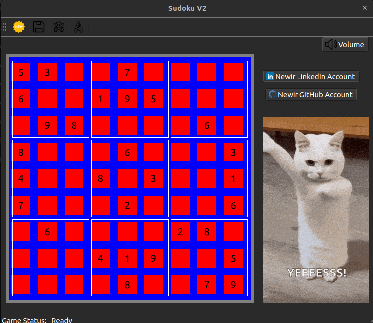

# Sudoku Game V2 Project
## Author: [Mohamed Newir](https://www.linkedin.com/in/mohamed-newir-a8a572182)

## Overview
project I made as a fun way to refresh my knowledge after a personal time off I took from engineering ^^, following teaching two rounds at ITI. I chose to refactor and optimize a previous Sudoku game project I had developed as part of my **software development diploma** at **Edges for Training**. I used C++ OOP, Qt6 and CMake to develop the game, adding new features in the process.


## Project Description
This is a Graphical User Interface Application implementation using **Qt** of the popular **Sudoku puzzle**, built in **C++ with CMake** using a modular object-oriented approach. The project emphasizes clean design, separation of concerns, and practical use of the Standard Template Library (STL).

## The game supports the following functionalities:
- **Interactive Graphical  User Interface Application**: Play, solve, load, and save puzzles.
- **Backtracking Solver**: Solve any valid Sudoku puzzle.
- **Input Validation**: Ensures all moves and file inputs are correct.
- **Puzzle Generation**: Generates with different difficulty levels (Easy, Medium, Hard).

## Features
- Enter and validate player moves.
- Solve puzzles automatically using backtracking algorithm.
- Generates new puzzles using backtracking algorithm.
- Save the current puzzle state to a json file.
- Load puzzle from a file.
- Modular class structure to support scalability.

## Default Puzzle

### Upon starting, the Sudoku program displays the default board :



## Project Objectives
- Implement a fully functional Sudoku engine using a clean, modular structure.
- Demonstrate separation of concerns and proper software architecture.

## Functional Requirements
- Display a 9×9 Sudoku Grid using QML format.
- Display game using a Qt based application.
- Validate user inputs (row, column, value).
- Detect and reject invalid moves.
- Display a completed solution or indicate if the puzzle is unsolvable.

## Class Architecture
- **SudokuBoard**: Manages the 9x9 grid, validation, and board display.
- **SudokuSolver**: Implements the recursive backtracking solver.
- **SudokuGame**: Manages the game loop and user interaction.
- **SudokuGenerator**: Generates valid Sudoku puzzles using recursive backtracking Algorithm.

## File Management Architecture

## File Structure

```

```

## Demo


---
